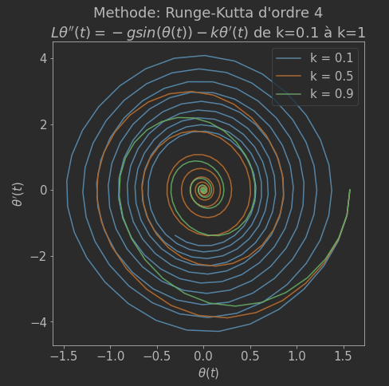

<!--
*** Thanks for checking out the Best-README-Template. If you have a suggestion
*** that would make this better, please fork the repo and create a pull request
*** or simply open an issue with the tag "enhancement".
*** Don't forget to give the project a star!
*** Thanks again! Now go create something AMAZING! :D
-->

<!-- PROJECT LOGO -->
 

<h3 align="center"> Calculator of Ordinary Differential Equations (ODE) (with 3 methods)</h3>

Supervised by our EDO teacher at IPSA.
  

## Built With

* [Python](https://www.python.org)

<!-- Methods -->
## Methods

* Euler explicit
* Runge-Kutta 4
* Runge-Kutta 2

## Package used

* Scipy
* Matplotlib
* warnings

